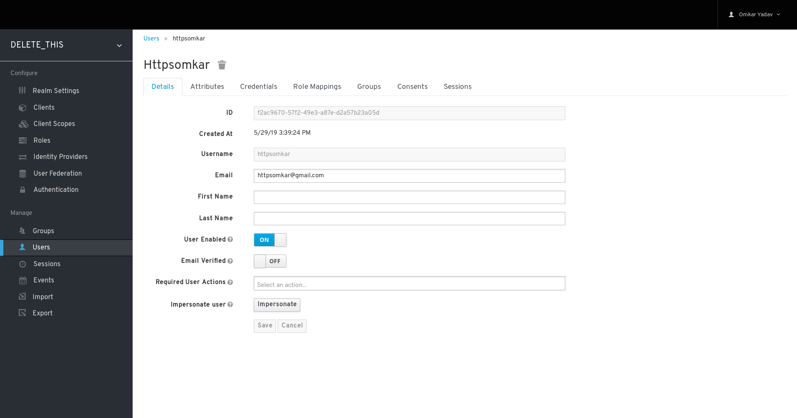
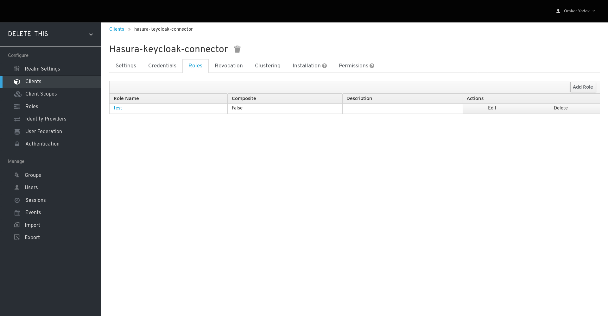
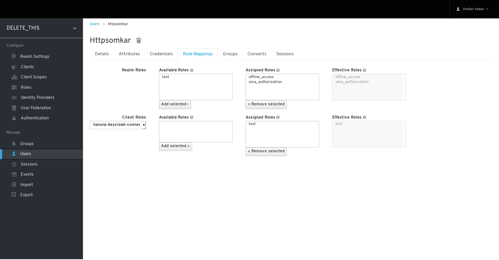

# Setup hasura instance

[Hasura docs](https://docs.hasura.io/1.0/graphql/manual/getting-started/index.html)
```yaml
version: '3.6'
services:
  postgres:
    image: postgres
    restart: always
    volumes:
      - db_data:/var/lib/postgresql/data
  graphql-engine:
    image: hasura/graphql-engine:v1.0.0-beta.2
    ports:
      - "8080:8080"
    depends_on:
      - "postgres"
    restart: always
    environment:
      HASURA_GRAPHQL_DATABASE_URL: postgres://postgres:@postgres:5432/postgres
      HASURA_GRAPHQL_ENABLE_CONSOLE: "true" # set to "false" to disable console
      HASURA_GRAPHQL_ADMIN_SECRET: myadminsecretkey # Your admin secret
      HASURA_GRAPHQL_AUTH_HOOK: http://auth:3000
  auth:
    image: httpsomkar/keycloak-hasura-connector:latest
    environment:
      KEYCLOAK_CLIENT_ID: ${KEYCLOAK_CLIENT_ID} # Keycloak backend client id from the keycloak setup. 
      KEYCLOAK_SERVER_URL: ${KEYCLOAK_URL} # Keycloak url in term of http://keycloak.COMPANY.com/auth
      KEYCLOAK_REALM: ${KEYCLOAK_REALM} # Default to master if any new create change to it
      KEYCLOAK_SECRET: ${KEYCLOAK_SECRET} # Secret copied from the backend client -> Credentials
      ANONYMOUS_ROLE: "anonymous" # (optional) Use this variable to set anonymous role name for unauthorized users as shown in the documentation: https://docs.hasura.io/1.0/graphql/manual/auth/authorization/common-roles-auth-examples.html#anonymous-not-logged-in-users
      USER_ID_FIELD: "sub" #The name of the token field that will be mapped to X-Hasura-User-Id
      KEYCLOAK_DEBUG: "true" # If testing enable mention this file

volumes:
  db_data:
```

[Example manifest](install-manifests/hasura-manifest.yml)

## Keycloak user config

* Now create new user


* Create client role


* Add user into the role

