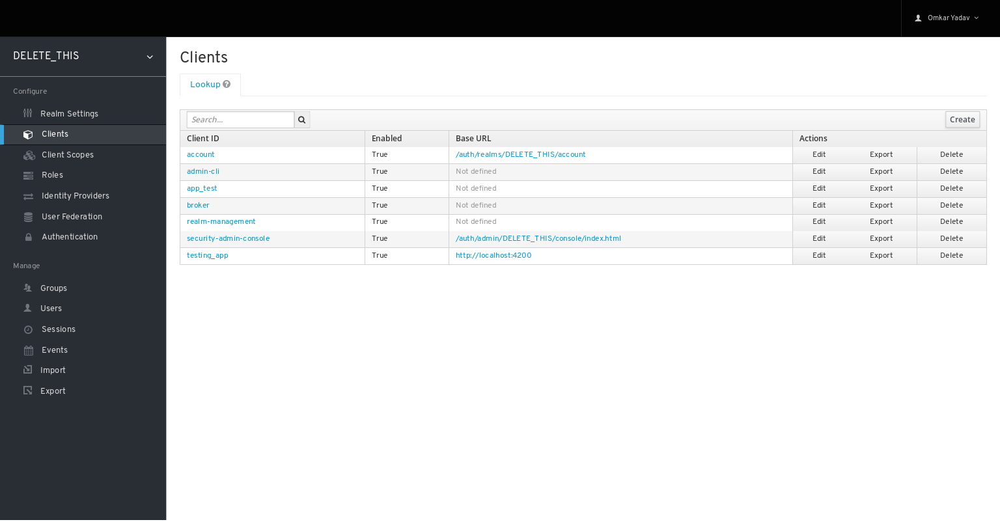

# Setup for keycloak

## Architecture of Keycloak Hasura Connector

## Setup the keycloak

[Installation of keycloak](keycloak-install-docker.md)

## Configure keycloak for the connector

You need to configure two clients in keycloak. One is for frontend(React, Angular, Svelte) and other for the Hasura engine.

### Create client for the frontend.
You need to create new public client in keycloak

* Login to keycloak admin. Keycloak admin url http://KEYCLOAK_URL/auth/admin
* Go to client

* Click on `Create`

    * `Client ID` Any unique client id you want
    * `Protocol` openid-connect
    * `Root URL` Root url of the application. Now we are using the http://localhost:4200
* Click on save

### Create client for backend
Now we will create backend for the hasura connector. It will require to verify the JWT token Obtained from the keycloak. 

* Login to keycloak admin. Keycloak admin url http://KEYCLOAK_URL/auth/admin
* Go to client

* Click on `Create`

* Click on save

* Select the `Access Type` to `bearer only` and client on `Save`

* Copy the Secret from Credentials

### Optional step for the X-Hasura-Group-Id
`X-Hasura-Group-Id` Obtained by the group of the user. If user is added into group called as group1 then user organization id will be group1
, and for nested groups /group1/subgroup the X-Hasura-Group-Id is group1. To access the user group in token we need to add the scope for it so let get started
> Following steps may vary for various keycloak version 

* Go to the Client scopes
* Click on create

* Click on Next

* Enter name `groups`
* Click on save

* Goto mappers
* Click on create

* Name: `groups` MapperType: `Group Membership` Token claim name `group`

Congratulations! You have configured you keycloak for the hasura connector

[Configure keycloak with hasura connector](hasura-config.md)
